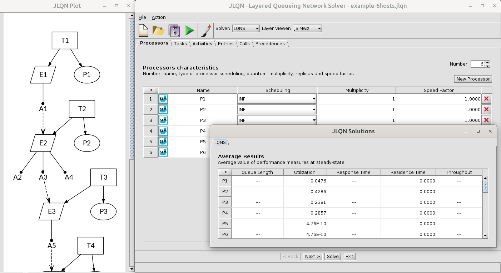

# JLQN
Java GUI for layered queueing network specification (alpha version)



## Getting started
You can launch the GUI using:
```
java -jar target/jlqn-singlejar.jar
``` 
Examples models are available under the *examples/* folder.

It is also possible to open directly a model using:
```
java -jar target/jlqn-singlejar.jar examples/example.jlqn
``` 
The JLQN GUI is shipped with the LN solver (Java version) of [LINE](https://line-solver.sourceforge.net/). JLQN also supports the [LQNS solver](https://www.sce.carleton.ca/rads/lqns/) if installed on the system. 

## Model assumptions
This version of JLQN takes the following assumptions: 
* All demands are exponentially distributed with the specified mean.
* No forwarding calls.
* A single activity can reply to an entry.

## Solver assumptions
LN (as of [LINE](https://line-solver.sf.net/) version 2.0.36):
* SRVN layering.
* Activities modelled as successive visits to the server.
  
LQNS:
* Batch layering.
* Activities modelled as service phases.

## License
GNU General Public License v2.0. 

## Regenerating Maven Artifacts
To regenerate the JARs located under `maven/mvn-artifact`, run the following command:
```bash
mvn deploy
```
This will deploy the build artifacts to the local project repository.
